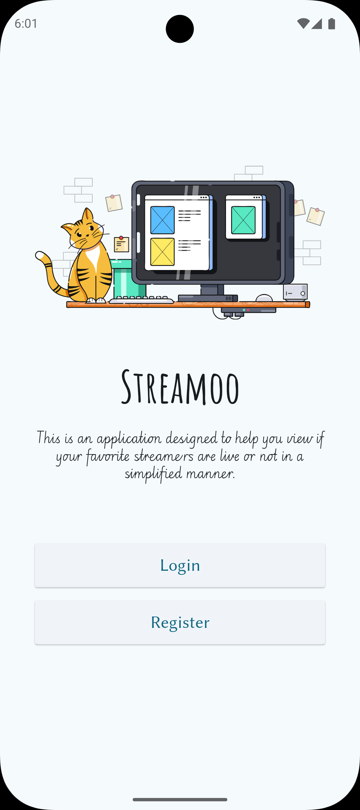
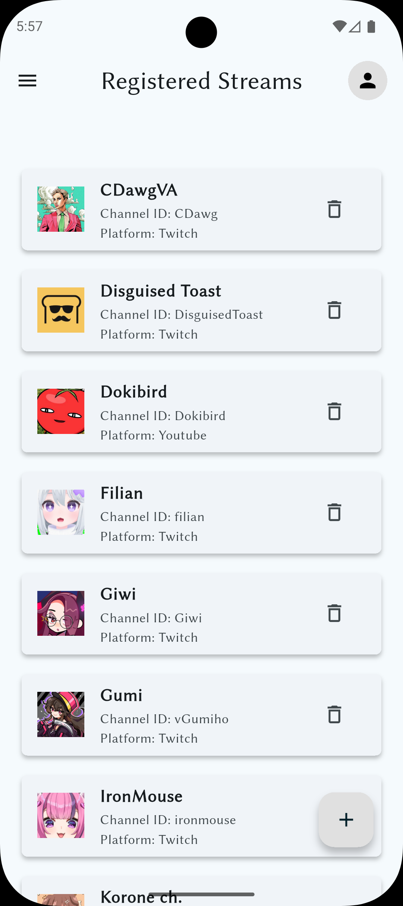
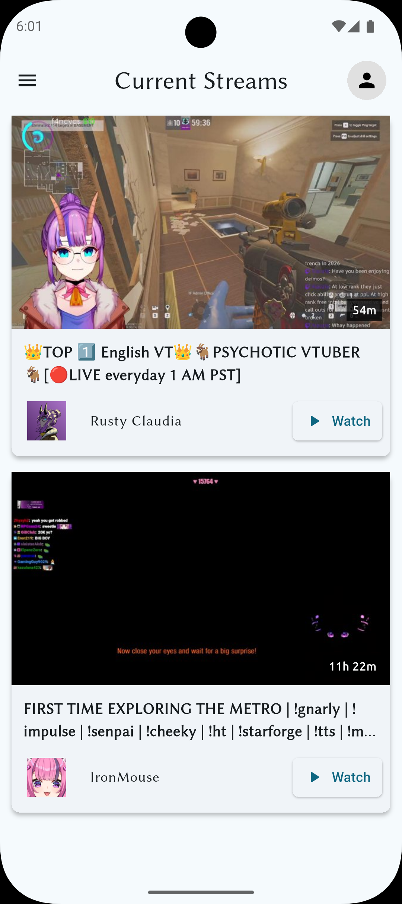

# Streamoo

A modern Flutter-based application to keep track of your favorite streamers and know exactly when they go live.

Streamoo focuses on simplicity and real-time visibility by providing a clean interface and a home screen widget—no notifications, no clutter, just the information you need.

## Features

- **Live Status Widget**: Quickly see which of your favorite streamers are live directly from your home screen.
- **Multi-Platform Support**: Track streamers across Twitch and YouTube.
- **Streamer Registration**: Add and manage your favorite streamers.
- **Live Stream Cards**: Clean card-style UI displaying:
  - Stream thumbnail
  - Live duration
  - Direct button to watch the stream
- **Dark Mode**: Dark mode support for a comfortable viewing experience.
- **Account Sync**: Firebase-powered authentication and syncing across multiple devices.

## Screenshots

|  |  |  |

## Technical Architecture

To ensure efficient and up-to-date stream tracking, Streamoo follows a polling-based architecture:

- **Polling**: The Flask backend queries Twitch and YouTube APIs every 15 minutes.
- **Change Detection**: When a streamer’s live status changes, the backend updates the database.
- **Storage**: Firestore stores:
  - User data
  - Streamer data
  - User-streamer relationships
- **Data Flow**:
  - App → Firestore → Backend → External APIs → Firestore → App
- **Widget Integration**: The home screen widget directly fetches live status data from Firestore for quick access.

## Tech Stack

- **Frontend**: Flutter
- **Backend**: Flask (Python) with `requests`
- **Database**: Firebase Firestore
- **Authentication**: Firebase Authentication
- **APIs**: Twitch API, YouTube Data API
- **Hosting**: Render (backend deployment)
- **CI/CD**: GitHub Actions

## Build Instructions

Follow these instructions to build and run the Streamoo application on your local machine.

### Prerequisites

Ensure you have the following installed:
* [Flutter SDK](https://docs.flutter.dev/get-started/install) (latest stable version recommended)
* [Android Studio](https://developer.android.com/studio) (for Android emulation/building)
* [Xcode](https://developer.apple.com/xcode/) (for iOS emulation/building - macOS only)
* A Firebase account

### 1. Clone the Repository

```bash
git clone https://github.com/yourusername/streamoo.git
cd streamoo
```

### 2. Install Dependencies

Fetch the required Flutter packages:
```bash
flutter pub get
```

### 3. Firebase Configuration

Streamoo relies on Firebase for authentication and database management. You must link your own Firebase project to run the app locally.

1. Create a new project in the [Firebase Console](https://console.firebase.google.com/).
2. Enable **Firestore Database** and **Firebase Authentication** (Email/Password or preferred providers).
3. Connect your app to Firebase.

### 4. Run the Application

Start a virtual emulator or connect a physical device, then run:

```bash
flutter run
